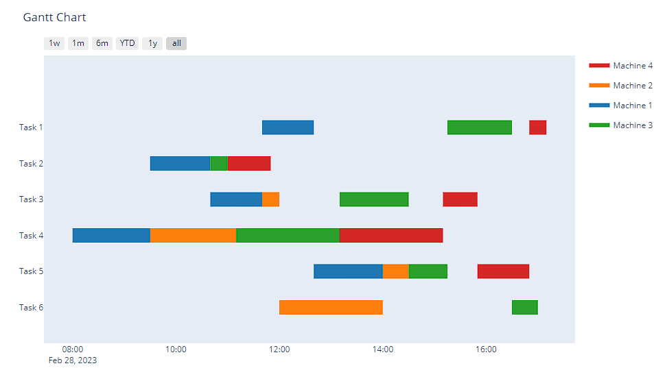

#  Technical Challenge: Job Shop Scheduling for MJM Marine

## Problem: To schedule and return the most optimised solution for scheduling the 6 jobs carried out by 4 teams where there is only 1 team working on a single job at a time and the teams can start working on a different job immediately

|   Job    | Machine 1 | Machine 2 | Machine 3 | Machine 4 |
|----------|--------------|----------|---------|----------|
|  Task 1  |      60      |    -     |    75   |    20    |
 | Task 2 |      70      |    -     |    20   |   50    |
 |   Task 3  |      60      |    20    |    80   |    40    |
 |   Task 4    |      90      |   100    |   120   |   120    |
 |  Task 5  |      80      |    30    |    45   |    60    |
|   Task 6   |      -       |   120    |    30   |    -     |
 

### Constraints: 
•	The machine 1 need to finish before the machine 2 can start, \
•	The machine 2 need to finish before the machine 3 can start, \
•	The machine 3 need to finish before the machine 4 can start.

## Problem Formulation: 
### Constraint Programming (CP):
Constraint Programming (CP) is utilized as the primary approach to solve the scheduling problem.
CP is a declarative programming paradigm where **relationships between variables are expressed as constraints**.

The **OR-Tools library**, specifically the CP-SAT solver, is employed to model and solve the optimization problem.

## Flowchart of Constraint Programming:
### Import Libraries &rarr; Declare model &rarr; Create Variables &rarr; Create Constraints &rarr; Call Solver &rarr; Plot

The input data, representing jobs, teams, and processing times, is organized into a structured format. **Pandas**, a powerful data manipulation library in Python, was used to handle the dataset efficiently.

Tasks within **each job are represented as intervals with start and end times**, constrained by the processing times and team availability.

The CP model is passed to the CP-SAT solver for optimization.
The **solver iteratively explores the search space to find an optimal solution that satisfies all constraints.**

Once an optimal solution is found, the assigned tasks are visualized using a **Gantt chart**.
**Plotly's figure factory (ff)** library is utilized to create the Gantt chart, providing a clear visualization of the schedule.

## Solution:

### Import Libraries

#### This code defines a function `visualize_schedule` that generates a schedule visualization by mapping assigned jobs to specific machines with corresponding start and finish times, based on a given plan date.

### Data pre-processing
#### Create the dataframe

#### This code segment creates a list of tuples for each job by selecting the team ID and processing time from the `jobs_df` DataFrame based on the job. Then, it organizes these tuples into nested lists representing all the jobs. It calculates the number of machines needed for the jobs and calculates the horizon, which represents the total time span required to complete all tasks across all jobs.

### Declare model
#### This code segment creates a CP model using the OR-Tools library. It defines named tuples to store information about variables representing task start and end times. It iterates over each job and task within the `jobs_data`, creating interval variables for each task and adding them to corresponding team lists based on the assigned machine. It constructs a dictionary `all_tasks` to store information about created variables.

### Create Variables and  constraints
#### This code segment adds constraints to the CP model to enforce that when a team finishes a task within a job, they may start the next task immediately. It iterates over each job and task within the `jobs_data`, ensuring that the end time of the current task is before the start time of the next task within the same job. Additionally, it creates and adds disjunctive constraints to ensure that tasks assigned to the same machine do not overlap in time. Finally, it defines the makespan objective to minimize the completion time of the last task in all jobs and adds it to the model for optimization.

### Call Solver
#### This code segment creates a solver object using the CP-SAT solver from OR-Tools and solves the CP model. It checks if the solver found an optimal solution and prints the optimal schedule length if one was found. If no solution was found, it prints a message indicating that no solution was found. Additionally, it constructs a dictionary `assigned_jobs` to store the assigned tasks per machine, including their start times, job IDs, task indices, and durations.

### Plot
#### Visualise the schedule using a Gantt chart

